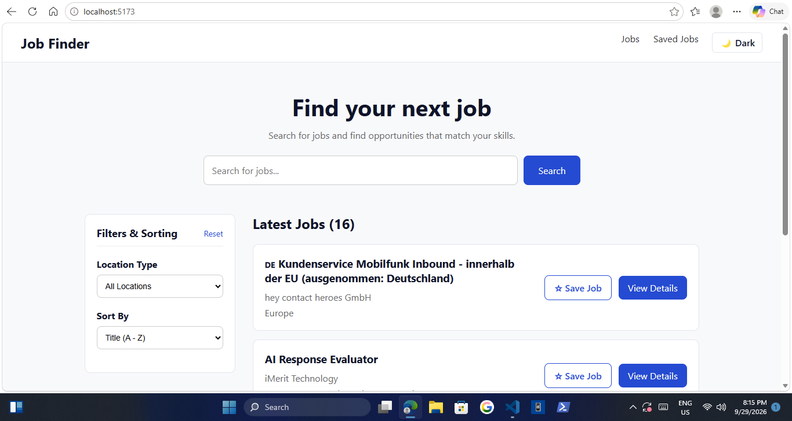
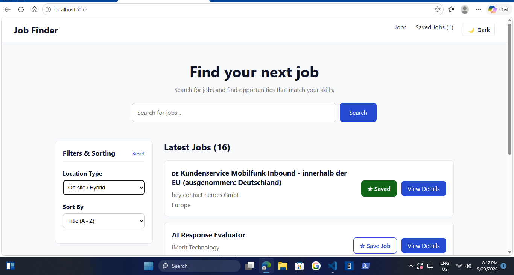
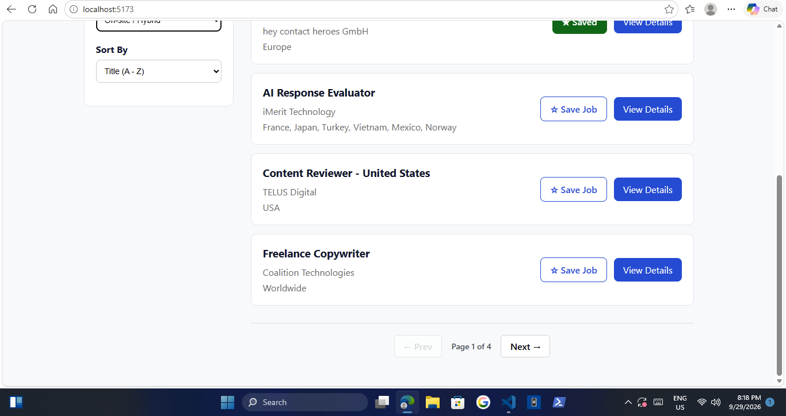
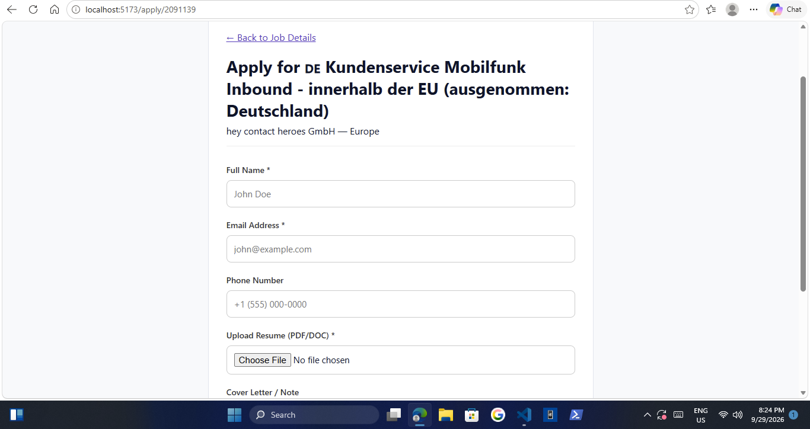

# 💼 React Job Finder App

A responsive, production-ready React application that allows users to browse remote job opportunities, search and filter listings, manage saved positions, and submit simulated job applications.


---

## ✨ Features

- **Dynamic Job Listings**: Fetches live remote positions using the Remotive REST API.
- **Search & Advanced Filtering**: Instant live search by keyword/company alongside location-type (Remote vs On-site) and alphabetical sorting filters.
- **Global Dark Mode**: Theme context with `localStorage` persistence and automatic system preference detection.
- **Saved Jobs Management**: Persistent bookmarking system using React Context API and `localStorage`.
- **Client-Side Pagination**: Clean data-slicing navigation controls to keep performance fast across long result sets.
- **Job Application Form**: Simulated application submission handling client-side state, form validations, file uploads, and routing feedback.
- **UX Polish**: Custom skeleton loading animations, toast pop-up notifications, and mobile drawer filtering navigation.

---

## 🛠️ Tech Stack

- **Frontend Library**: React 18 with TypeScript
- **Build Tool**: Vite
- **Routing**: React Router v6
- **State Management**: Context API (`JobContext`, `ThemeContext`)
- **Styling**: Vanilla CSS with CSS Variables / Custom Properties
- **API**: [Remotive Public API](https://remotive.com/api/remote-jobs)

---

## 🚀 Getting Started Locally

### Prerequisites

- Node.js (v18.0 or higher recommended)
- npm or yarn

### Installation

1. **Clone the repository:**
   ```bash
   git clone [https://github.com/your-username/job-finder.git](https://github.com/your-username/job-finder.git)
   cd job-finder
   ```
2. **Install dependencies**
   `npm install`
3. **Start the development server**
   ``npm run dev`

4. **Open http://localhost:5173 in your browser.**

**📁 Project Structure**

src/
├── components/ # Reusable UI elements (JobCard, Navbar, Toast,SearchBar,Skeleton)
├── context/ # React Context providers (JobContext, ThemeContext)
├── pages/ # View routes (Home, JobDetails, SavedJobs, ApplyJob, NotFound)
├── services/ # API fetch wrappers and data mappers
├── types/ # TypeScript interface definitions
├── App.tsx # Main application routing tree
└── index.css # Global CSS variables and component styles

**Screenshots**






